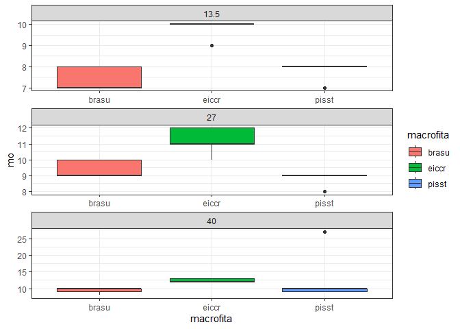

<!-- README.md is generated from README.Rmd. Please edit that file -->

# Análise de dados macrofitas-cpfl

## Carregando Pacotes

``` r
library(tidyverse)
```

#### [Análise multivariada](https://arpanosso.github.io/macrofitas-cpfl/Docs/analise-multivariada.html)

#### [Análise de variância - Solo](https://arpanosso.github.io/macrofitas-cpfl/Docs/analise-varianca.html)

#### [Análise de variância -Crescimento Braquiária](https://arpanosso.github.io/macrofitas-cpfl/Docs/analise-crescimento.html)

## Pré-processamento

``` r
sheets <- readxl::excel_sheets("data-raw/dadoscpfl.xlsx")
```

### Composição química

Leitura do banco

``` r
df <- readxl::read_xlsx("data-raw/dadoscpfl.xlsx",
                        sheet = sheets[1],
                        skip = 1) %>% 
  rename(data = "...1") %>% 
  janitor::clean_names() %>% 
  mutate(
    amostra = str_to_lower(amostra),
    cd = as.numeric(ifelse(cd == "<1",0.5,cd)),
    cr = as.numeric(ifelse(cr == "<1",0.5,cr)),
    pb = as.numeric(ifelse(pb == "<1",0.5,pb))
  )
```

Resumo rápido do banco de dados

``` r
glimpse(df)
#> Rows: 35
#> Columns: 17
#> $ data    <dttm> 2018-02-01, 2018-02-01, 2018-02-01, 2018-02-01, 2018-02-01, 2…
#> $ amostra <chr> "brasu", "brasu", "brasu", "brasu", "brasu", "eiccr", "eiccr",…
#> $ n       <dbl> 10.6, 9.5, 7.9, 7.4, 12.5, 15.4, 20.0, 15.3, 20.2, 20.4, 26.6,…
#> $ p       <dbl> 0.7, 0.5, 0.6, 0.4, 0.4, 1.5, 2.4, 1.6, 2.3, 2.1, 2.5, 4.1, 4.…
#> $ k       <dbl> 19.7, 13.6, 14.3, 6.5, 4.7, 41.2, 43.8, 36.2, 35.3, 33.9, 43.6…
#> $ ca      <dbl> 1.4, 1.3, 2.2, 1.4, 0.6, 19.9, 15.6, 17.6, 18.9, 15.5, 34.4, 3…
#> $ mg      <dbl> 1.3, 1.2, 1.7, 1.2, 0.7, 5.2, 5.6, 5.4, 6.1, 4.8, 7.7, 7.1, 6.…
#> $ s       <dbl> 2.3, 1.4, 2.3, 2.1, 1.6, 2.1, 2.5, 2.2, 2.7, 2.7, 3.0, 3.1, 3.…
#> $ b       <dbl> 13, 8, 6, 6, 4, 31, 34, 36, 35, 30, 58, 67, 64, 75, 67, 4, 5, …
#> $ cu      <dbl> 2, 3, 2, 1, 1, 12, 16, 15, 15, 15, 13, 22, 22, 16, 19, 3, 4, 4…
#> $ fe      <dbl> 468, 1161, 234, 158, 408, 6533, 11368, 7814, 6299, 6977, 4059,…
#> $ mn      <dbl> 95, 293, 102, 47, 105, 1653, 2512, 1282, 2037, 1500, 2178, 355…
#> $ zn      <dbl> 12, 20, 14, 7, 9, 41, 62, 61, 44, 53, 78, 107, 101, 71, 99, 21…
#> $ cd      <dbl> 0.5, 0.5, 0.5, 0.5, 0.5, 1.5, 1.3, 1.4, 1.1, 0.5, 1.6, 0.5, 1.…
#> $ ni      <dbl> 1.6, 2.3, 3.3, 2.1, 1.1, 12.6, 21.3, 15.6, 16.6, 13.6, 15.4, 2…
#> $ cr      <dbl> 1.5, 2.5, 0.5, 1.1, 0.5, 6.5, 12.9, 5.9, 4.8, 4.7, 3.6, 8.9, 8…
#> $ pb      <dbl> 0.5, 0.5, 0.5, 0.5, 0.5, 2.5, 3.5, 3.0, 3.0, 2.5, 4.0, 5.5, 4.…
```

Resumo geral

``` r
skimr::skim(df)
```

|                                                  |      |
|:-------------------------------------------------|:-----|
| Name                                             | df   |
| Number of rows                                   | 35   |
| Number of columns                                | 17   |
| \_\_\_\_\_\_\_\_\_\_\_\_\_\_\_\_\_\_\_\_\_\_\_   |      |
| Column type frequency:                           |      |
| character                                        | 1    |
| numeric                                          | 15   |
| POSIXct                                          | 1    |
| \_\_\_\_\_\_\_\_\_\_\_\_\_\_\_\_\_\_\_\_\_\_\_\_ |      |
| Group variables                                  | None |

Data summary

**Variable type: character**

| skim_variable | n_missing | complete_rate | min | max | empty | n_unique | whitespace |
|:--------------|----------:|--------------:|----:|----:|------:|---------:|-----------:|
| amostra       |         0 |             1 |   5 |   5 |     0 |        5 |          0 |

**Variable type: numeric**

| skim_variable | n_missing | complete_rate |    mean |      sd |    p0 |    p25 |    p50 |     p75 |    p100 | hist  |
|:--------------|----------:|--------------:|--------:|--------:|------:|-------:|-------:|--------:|--------:|:------|
| n             |         0 |             1 |   24.60 |   10.30 |   7.4 |  15.05 |   27.1 |   30.55 |    40.7 | ▃▆▂▇▃ |
| p             |         0 |             1 |    2.51 |    1.38 |   0.4 |   0.85 |    3.2 |    3.35 |     4.5 | ▇▁▂▇▅ |
| k             |         0 |             1 |   34.85 |   15.58 |   4.7 |  20.85 |   35.3 |   50.30 |    59.0 | ▃▇▃▅▇ |
| ca            |         0 |             1 |   14.91 |   11.52 |   0.6 |   2.15 |   16.4 |   20.30 |    37.7 | ▆▃▇▂▂ |
| mg            |         0 |             1 |    4.12 |    2.17 |   0.7 |   1.70 |    4.8 |    5.50 |     7.7 | ▇▃▂▇▆ |
| s             |         0 |             1 |    2.75 |    0.46 |   1.4 |   2.50 |    2.8 |    3.10 |     3.2 | ▁▁▂▅▇ |
| b             |         0 |             1 |   31.23 |   20.85 |   4.0 |  15.50 |   30.0 |   48.50 |    75.0 | ▇▇▃▅▃ |
| cu            |         0 |             1 |   12.34 |    7.31 |   1.0 |   4.00 |   13.0 |   19.00 |    23.0 | ▇▁▇▃▇ |
| fe            |         0 |             1 | 4255.63 | 3928.64 | 158.0 | 865.00 | 2698.0 | 6755.00 | 14068.0 | ▇▂▂▂▁ |
| mn            |         0 |             1 | 1525.71 | 1092.84 |  47.0 | 291.00 | 1616.0 | 2140.00 |  4331.0 | ▇▇▇▂▂ |
| zn            |         0 |             1 |   56.37 |   33.49 |   7.0 |  23.00 |   56.0 |   72.00 |   146.0 | ▆▇▅▂▁ |
| cd            |         0 |             1 |    0.87 |    0.43 |   0.5 |   0.50 |    0.5 |    1.25 |     1.7 | ▇▁▃▂▂ |
| ni            |         0 |             1 |   12.63 |    6.89 |   1.1 |   5.85 |   14.0 |   16.15 |    27.5 | ▅▁▇▃▁ |
| cr            |         0 |             1 |    7.35 |    3.93 |   0.5 |   4.95 |    7.3 |   10.30 |    13.7 | ▃▃▇▂▆ |
| pb            |         0 |             1 |   11.18 |   12.56 |   0.5 |   2.50 |    5.0 |   16.65 |    59.0 | ▇▅▁▁▁ |

**Variable type: POSIXct**

| skim_variable | n_missing | complete_rate | min        | max        | median     | n_unique |
|:--------------|----------:|--------------:|:-----------|:-----------|:-----------|---------:|
| data          |         0 |             1 | 2018-02-01 | 2018-06-01 | 2018-06-01 |        2 |

## Salvar o df em rds

``` r
write_rds(df,"data/quimica-macrofita")
```

#### Corrplot geral

``` r
# A programar
```

#### Corrplot por data

``` r
# A programar
```

### Experimento de apicação em solo

Leitura do banco

``` r
dff <- readxl::read_xlsx("data-raw/dadoscpfl.xlsx",
                        sheet = sheets[3],
                        skip = 1) %>% 
  janitor::clean_names() %>% 
  mutate(
    macrofita = str_to_lower(macrofita),
    cr = ifelse(is.na(cr),0,cr),
    cd = ifelse(is.na(cd),0,cd)
  )
```

Resumo rápido do banco de dados

``` r
glimpse(dff)
#> Rows: 50
#> Columns: 24
#> $ macrofita <chr> "brasu", "brasu", "brasu", "brasu", "brasu", "brasu", "brasu…
#> $ dose_t_ha <dbl> 13.5, 13.5, 13.5, 13.5, 13.5, 27.0, 27.0, 27.0, 27.0, 27.0, …
#> $ repeticao <dbl> 1, 2, 3, 4, 5, 1, 2, 3, 4, 5, 1, 2, 3, 4, 5, 1, 2, 3, 4, 5, …
#> $ mo        <dbl> 8, 7, 8, 7, 7, 10, 10, 9, 9, 9, 9, 10, 10, 8, 10, 8, 8, 8, 7…
#> $ p_h       <dbl> 5.8, 5.8, 5.9, 6.0, 6.0, 6.1, 6.0, 5.7, 6.1, 6.1, 6.1, 6.1, …
#> $ p         <dbl> 3, 4, 4, 3, 4, 4, 4, 3, 5, 4, 4, 3, 3, 3, 3, 8, 7, 7, 7, 10,…
#> $ k         <dbl> 1.01, 0.86, 5.64, 4.57, 4.71, 11.86, 11.95, 7.78, 9.33, 7.70…
#> $ ca        <dbl> 17.95, 19.95, 18.98, 15.81, 16.37, 21.79, 21.03, 17.19, 20.6…
#> $ mg        <dbl> 6.29, 6.90, 6.64, 5.57, 5.76, 7.50, 7.55, 6.14, 6.91, 5.93, …
#> $ al        <dbl> 0.28, 0.25, 0.19, 0.26, 0.20, 0.21, 0.22, 0.22, 0.20, 0.14, …
#> $ h_al      <dbl> 14, 15, 15, 15, 15, 15, 15, 17, 13, 14, 14, 14, 16, 16, 14, …
#> $ s         <dbl> 24, 26, 25, 20, 18, 45, 50, 30, 41, 36, 40, 45, 48, 35, 45, …
#> $ sb        <dbl> 25.25, 27.71, 31.26, 25.95, 26.84, 41.15, 40.53, 31.11, 36.8…
#> $ ctc       <dbl> 39.25, 42.71, 46.26, 40.95, 41.84, 56.15, 55.53, 48.11, 49.8…
#> $ v_percent <dbl> 64.33, 64.88, 67.57, 63.37, 64.15, 73.29, 72.99, 64.66, 73.9…
#> $ b         <dbl> 0.19, 0.15, 0.15, 0.16, 0.16, 0.16, 0.17, 0.16, 0.18, 0.20, …
#> $ cu        <dbl> 0.4, 0.4, 0.4, 0.3, 0.3, 0.3, 0.3, 0.3, 0.3, 0.3, 0.3, 0.3, …
#> $ mn        <dbl> 3.6, 4.1, 3.6, 3.2, 3.2, 3.3, 3.5, 3.5, 3.7, 3.5, 3.8, 3.5, …
#> $ fe        <dbl> 10, 10, 9, 9, 9, 8, 8, 10, 10, 9, 10, 9, 9, 8, 8, 7, 8, 7, 7…
#> $ zn        <dbl> 0.4, 0.4, 0.4, 0.3, 0.3, 0.5, 0.5, 0.4, 0.4, 0.4, 0.5, 0.5, …
#> $ cr        <dbl> 0.08, 0.07, 0.10, 0.08, 0.08, 0.13, 0.09, 0.11, 0.11, 0.12, …
#> $ ni        <dbl> 0.16, 0.13, 0.21, 0.13, 0.18, 0.16, 0.20, 0.12, 0.18, 0.20, …
#> $ cd        <dbl> 0.02, 0.00, 0.01, 0.02, 0.02, 0.02, 0.02, 0.03, 0.02, 0.02, …
#> $ pb        <dbl> 0.59, 0.60, 0.61, 0.49, 0.49, 0.60, 0.68, 0.42, 0.45, 0.44, …
```

Resumo geral

``` r
skimr::skim(dff)
```

|                                                  |      |
|:-------------------------------------------------|:-----|
| Name                                             | dff  |
| Number of rows                                   | 50   |
| Number of columns                                | 24   |
| \_\_\_\_\_\_\_\_\_\_\_\_\_\_\_\_\_\_\_\_\_\_\_   |      |
| Column type frequency:                           |      |
| character                                        | 1    |
| numeric                                          | 23   |
| \_\_\_\_\_\_\_\_\_\_\_\_\_\_\_\_\_\_\_\_\_\_\_\_ |      |
| Group variables                                  | None |

Data summary

**Variable type: character**

| skim_variable | n_missing | complete_rate | min | max | empty | n_unique | whitespace |
|:--------------|----------:|--------------:|----:|----:|------:|---------:|-----------:|
| macrofita     |         0 |             1 |   5 |   6 |     0 |        4 |          0 |

**Variable type: numeric**

| skim_variable | n_missing | complete_rate |  mean |    sd |    p0 |   p25 |   p50 |   p75 |  p100 | hist  |
|:--------------|----------:|--------------:|------:|------:|------:|------:|------:|------:|------:|:------|
| dose_t_ha     |         5 |           0.9 | 26.83 | 10.94 | 13.50 | 13.50 | 27.00 | 40.00 | 40.00 | ▇▁▇▁▇ |
| repeticao     |         0 |           1.0 |  3.00 |  1.43 |  1.00 |  2.00 |  3.00 |  4.00 |  5.00 | ▇▇▇▇▇ |
| mo            |         0 |           1.0 |  9.62 |  3.02 |  7.00 |  8.00 |  9.00 | 10.00 | 27.00 | ▇▁▁▁▁ |
| p_h           |         0 |           1.0 |  6.10 |  0.33 |  5.30 |  5.90 |  6.10 |  6.40 |  6.70 | ▁▂▇▃▃ |
| p             |         0 |           1.0 |  7.44 |  5.53 |  3.00 |  4.00 |  6.00 |  7.00 | 30.00 | ▇▁▁▁▁ |
| k             |         0 |           1.0 |  9.22 |  6.00 |  0.86 |  5.04 |  8.25 | 11.41 | 24.62 | ▅▇▂▂▂ |
| ca            |         0 |           1.0 | 25.69 |  9.12 | 15.81 | 18.37 | 22.25 | 28.46 | 47.95 | ▇▅▁▂▁ |
| mg            |         0 |           1.0 |  8.36 |  2.15 |  5.57 |  6.59 |  7.84 |  9.53 | 14.44 | ▇▆▃▁▁ |
| al            |         0 |           1.0 |  0.19 |  0.05 |  0.12 |  0.14 |  0.18 |  0.22 |  0.32 | ▇▆▅▂▁ |
| h_al          |         0 |           1.0 | 14.46 |  1.53 | 12.00 | 13.00 | 14.50 | 15.00 | 18.00 | ▇▆▇▃▃ |
| s             |         0 |           1.0 | 32.94 | 12.24 |  8.00 | 24.00 | 35.00 | 40.00 | 58.00 | ▃▇▇▆▃ |
| sb            |         0 |           1.0 | 43.27 | 16.71 | 24.47 | 31.15 | 38.87 | 47.00 | 85.19 | ▇▇▁▂▂ |
| ctc           |         0 |           1.0 | 57.73 | 15.85 | 39.25 | 46.34 | 53.33 | 61.74 | 98.19 | ▇▆▁▂▂ |
| v_percent     |         0 |           1.0 | 73.03 |  7.86 | 59.01 | 67.57 | 73.30 | 78.08 | 87.65 | ▅▅▇▅▅ |
| b             |         0 |           1.0 |  0.20 |  0.04 |  0.15 |  0.17 |  0.19 |  0.22 |  0.34 | ▇▅▂▂▁ |
| cu            |         0 |           1.0 |  0.30 |  0.10 |  0.10 |  0.23 |  0.30 |  0.30 |  0.60 | ▃▇▂▁▁ |
| mn            |         0 |           1.0 |  3.24 |  0.79 |  1.40 |  2.82 |  3.35 |  3.60 |  6.00 | ▃▅▇▁▁ |
| fe            |         0 |           1.0 |  8.72 |  1.05 |  7.00 |  8.00 |  9.00 | 10.00 | 10.00 | ▃▆▁▇▇ |
| zn            |         0 |           1.0 |  0.57 |  0.21 |  0.30 |  0.40 |  0.50 |  0.60 |  1.10 | ▆▇▁▂▂ |
| cr            |         0 |           1.0 |  0.06 |  0.04 |  0.00 |  0.03 |  0.06 |  0.09 |  0.14 | ▇▇▇▇▂ |
| ni            |         0 |           1.0 |  0.18 |  0.04 |  0.07 |  0.15 |  0.18 |  0.21 |  0.28 | ▂▃▇▇▁ |
| cd            |         0 |           1.0 |  0.02 |  0.01 |  0.00 |  0.01 |  0.02 |  0.03 |  0.04 | ▃▂▇▆▁ |
| pb            |         0 |           1.0 |  0.51 |  0.09 |  0.30 |  0.44 |  0.50 |  0.59 |  0.68 | ▁▇▇▇▃ |

## Salvar o df em rds

``` r
write_rds(dff,"data/solo-macrofita")
```

#### Boxplot por tratamentos por variável

``` r
# A programar
dff %>% 
  filter(macrofita != "testem") %>% 
  ggplot(aes(x=macrofita,y=mo, fill=macrofita)) +
  geom_boxplot() +
  facet_wrap(~dose_t_ha, scales = "free", ncol = 1) +
  theme_bw()
```

<!-- -->

### Experimento de Crecimento da Braquiária

Leitura do banco

``` r
dfff <- readxl::read_xlsx("data-raw/dadoscpfl.xlsx",
                        sheet = sheets[2]) %>% 
  janitor::clean_names() %>% 
  mutate(
    dose = ifelse(dose == "20/ t/ha", "20 t/ha",ifelse(dose == "22 t/ha", "20 t/ha",dose))
  )
```

Resumo rápido do banco de dados

``` r
glimpse(dfff)
#> Rows: 40
#> Columns: 7
#> $ especie   <chr> "TESTE", "TESTE", "TESTE", "TESTE", "BRASU", "BRASU", "BRASU…
#> $ dose      <chr> NA, NA, NA, NA, "05 t/ha", "05 t/ha", "05 t/ha", "05 t/ha", …
#> $ repeticao <dbl> 1, 2, 3, 4, 1, 2, 3, 4, 1, 2, 3, 4, 1, 2, 3, 4, 1, 2, 3, 4, …
#> $ altura    <dbl> 34.8, 35.0, 32.9, 36.5, 36.8, 37.9, 41.2, 38.2, 39.6, 35.0, …
#> $ perfilho  <dbl> 4.100, 3.530, 3.610, 3.960, 4.120, 5.600, 3.350, 4.530, 6.92…
#> $ p_aerea   <dbl> 4.01000, 3.57000, 3.42000, 3.52000, 2.11000, 3.12000, 2.1400…
#> $ raiz      <dbl> 1.33000, 0.99000, 1.02000, 1.06000, 0.98000, 0.89000, 0.9100…
```

Resumo geral

``` r
skimr::skim(dff)
```

|                                                  |      |
|:-------------------------------------------------|:-----|
| Name                                             | dff  |
| Number of rows                                   | 50   |
| Number of columns                                | 24   |
| \_\_\_\_\_\_\_\_\_\_\_\_\_\_\_\_\_\_\_\_\_\_\_   |      |
| Column type frequency:                           |      |
| character                                        | 1    |
| numeric                                          | 23   |
| \_\_\_\_\_\_\_\_\_\_\_\_\_\_\_\_\_\_\_\_\_\_\_\_ |      |
| Group variables                                  | None |

Data summary

**Variable type: character**

| skim_variable | n_missing | complete_rate | min | max | empty | n_unique | whitespace |
|:--------------|----------:|--------------:|----:|----:|------:|---------:|-----------:|
| macrofita     |         0 |             1 |   5 |   6 |     0 |        4 |          0 |

**Variable type: numeric**

| skim_variable | n_missing | complete_rate |  mean |    sd |    p0 |   p25 |   p50 |   p75 |  p100 | hist  |
|:--------------|----------:|--------------:|------:|------:|------:|------:|------:|------:|------:|:------|
| dose_t_ha     |         5 |           0.9 | 26.83 | 10.94 | 13.50 | 13.50 | 27.00 | 40.00 | 40.00 | ▇▁▇▁▇ |
| repeticao     |         0 |           1.0 |  3.00 |  1.43 |  1.00 |  2.00 |  3.00 |  4.00 |  5.00 | ▇▇▇▇▇ |
| mo            |         0 |           1.0 |  9.62 |  3.02 |  7.00 |  8.00 |  9.00 | 10.00 | 27.00 | ▇▁▁▁▁ |
| p_h           |         0 |           1.0 |  6.10 |  0.33 |  5.30 |  5.90 |  6.10 |  6.40 |  6.70 | ▁▂▇▃▃ |
| p             |         0 |           1.0 |  7.44 |  5.53 |  3.00 |  4.00 |  6.00 |  7.00 | 30.00 | ▇▁▁▁▁ |
| k             |         0 |           1.0 |  9.22 |  6.00 |  0.86 |  5.04 |  8.25 | 11.41 | 24.62 | ▅▇▂▂▂ |
| ca            |         0 |           1.0 | 25.69 |  9.12 | 15.81 | 18.37 | 22.25 | 28.46 | 47.95 | ▇▅▁▂▁ |
| mg            |         0 |           1.0 |  8.36 |  2.15 |  5.57 |  6.59 |  7.84 |  9.53 | 14.44 | ▇▆▃▁▁ |
| al            |         0 |           1.0 |  0.19 |  0.05 |  0.12 |  0.14 |  0.18 |  0.22 |  0.32 | ▇▆▅▂▁ |
| h_al          |         0 |           1.0 | 14.46 |  1.53 | 12.00 | 13.00 | 14.50 | 15.00 | 18.00 | ▇▆▇▃▃ |
| s             |         0 |           1.0 | 32.94 | 12.24 |  8.00 | 24.00 | 35.00 | 40.00 | 58.00 | ▃▇▇▆▃ |
| sb            |         0 |           1.0 | 43.27 | 16.71 | 24.47 | 31.15 | 38.87 | 47.00 | 85.19 | ▇▇▁▂▂ |
| ctc           |         0 |           1.0 | 57.73 | 15.85 | 39.25 | 46.34 | 53.33 | 61.74 | 98.19 | ▇▆▁▂▂ |
| v_percent     |         0 |           1.0 | 73.03 |  7.86 | 59.01 | 67.57 | 73.30 | 78.08 | 87.65 | ▅▅▇▅▅ |
| b             |         0 |           1.0 |  0.20 |  0.04 |  0.15 |  0.17 |  0.19 |  0.22 |  0.34 | ▇▅▂▂▁ |
| cu            |         0 |           1.0 |  0.30 |  0.10 |  0.10 |  0.23 |  0.30 |  0.30 |  0.60 | ▃▇▂▁▁ |
| mn            |         0 |           1.0 |  3.24 |  0.79 |  1.40 |  2.82 |  3.35 |  3.60 |  6.00 | ▃▅▇▁▁ |
| fe            |         0 |           1.0 |  8.72 |  1.05 |  7.00 |  8.00 |  9.00 | 10.00 | 10.00 | ▃▆▁▇▇ |
| zn            |         0 |           1.0 |  0.57 |  0.21 |  0.30 |  0.40 |  0.50 |  0.60 |  1.10 | ▆▇▁▂▂ |
| cr            |         0 |           1.0 |  0.06 |  0.04 |  0.00 |  0.03 |  0.06 |  0.09 |  0.14 | ▇▇▇▇▂ |
| ni            |         0 |           1.0 |  0.18 |  0.04 |  0.07 |  0.15 |  0.18 |  0.21 |  0.28 | ▂▃▇▇▁ |
| cd            |         0 |           1.0 |  0.02 |  0.01 |  0.00 |  0.01 |  0.02 |  0.03 |  0.04 | ▃▂▇▆▁ |
| pb            |         0 |           1.0 |  0.51 |  0.09 |  0.30 |  0.44 |  0.50 |  0.59 |  0.68 | ▁▇▇▇▃ |

## Salvar o df em rds

``` r
write_rds(dfff,"data/crescimento-braquiaria")
```

#### Boxplot por tratamentos por variável

``` r
# A programar
dfff %>% 
  filter(especie != "TESTE") %>% 
  ggplot(aes(x=especie, y=altura, fill=dose)) +
  geom_boxplot() +
  facet_wrap(~dose, scales = "free") +
  theme_bw()
```

<!-- -->
